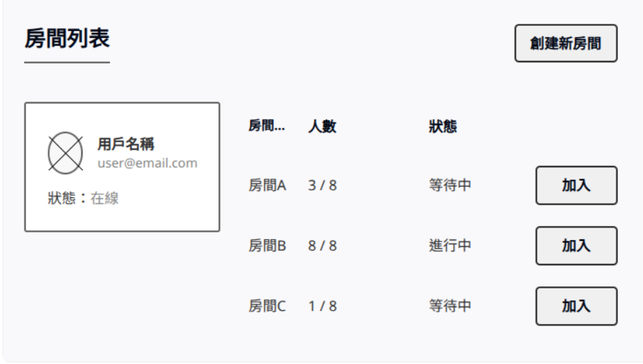

# Multiplayer Drawing Game

A real-time multiplayer drawing game built with React, TypeScript, and Vite.

## Features

- **Real-time Multiplayer Gameplay:**
    - Collaborative drawing on a synchronized canvas.
    - Instant updates for chat messages, scores, and game timers.
- **Game Room Management:**
    - Browse existing game rooms with current player count and status (waiting/in-progress).
    - Create new game rooms or join existing ones.
- **Interactive Game Interface:**
    - Dedicated drawing tools for the designated drawer (e.g., brush, eraser, color selection).
    - Guess input for other players.
    - Real-time display of player scores and a leaderboard.
- **User Authentication:** Secure player login and identification.
- **AI Bot Integration:** Bots can automatically join rooms to ensure games can proceed even with fewer players.
- **Turn-based Structure:** Clear indication of whose turn it is to draw and who is guessing.
- **Round End Summary:** Display of the correct answer after each round.

## Game Overview

This multiplayer drawing game revolves around two primary interfaces: the **Room List Page** and the **Game Page**.

### Room List Page

Upon starting, players land on the Room List Page. Here, they can:
- View all available game rooms, along with their current player count and status (e.g., "Waiting", "In Progress").
- Create a new game room.
- Join an existing room to participate.
- See their own user information (name, email, online status).

### Game Page

The Game Page is the heart of the game, where players draw and guess. Key elements include:
- **Synchronized Drawing Canvas:** All players see the drawing unfold in real-time.
- **Drawing Tools:** The designated drawer has access to tools like a brush, eraser, and color palette.
- **Guessing Area:** Other players submit their guesses here.
- **Chat Box:** For real-time communication and displaying game messages.
- **Timer:** Each round is timed to keep the game moving.
- **Topic Display:** Shown only to the current drawer.
- **Player List & Scores:** Displays all participants and their current scores.
- **Round End Information:** A modal appears at the end of each round, revealing the correct answer.

## User Flow

The following diagram illustrates the typical user journey through the game:


The general flow is as follows:
1.  **Entry:** Player starts the game and lands on the Room List page.
2.  **Room Selection/Creation:** Player either joins an existing game room or creates a new one.
3.  **Waiting Phase:** Players wait in the room until the game starts (e.g., enough players have joined).
4.  **Gameplay Loop (per round):**
    *   The system designates one player as the drawer.
    *   The drawer receives a topic and uses drawing tools to depict it on the canvas.
    *   Other players view the drawing in real-time and submit their guesses.
5.  **Scoring:** After each round, scores are updated based on correct guesses and drawing performance.
6.  **Next Round/Game End:** The game proceeds to the next round with a new drawer, or concludes if all rounds are complete, displaying final results.

## UI Wireframes

The following wireframes provide a visual guide to the main game interfaces:

### Room List Page

This wireframe shows the layout of the page where players can see and join available game rooms or create a new one.



### Game Page

This wireframe illustrates the main game screen, including the drawing canvas, guessing area, chat, player list, and timer.


## Tech Stack

- React
- TypeScript
- Vite
- Tailwind CSS
- React Router

## Getting Started

### Prerequisites

- Node.js (v18 or higher)
- npm or yarn

### Installation and Setup

1. Clone the repository
   ```bash
   git clone https://github.com/fromtaoyuanhsinchuuuu/CNL-Final-Project.git
   cd CNL-Final-Project
   ```

2. Install dependencies
   ```bash
   npm install
   # or
   yarn
   ```

3. Start the development server
   ```bash
   npm run dev
   # or
   yarn dev
   ```

4. The browser should automatically open to the application. If not, navigate to `http://localhost:5173` (or the port shown in your terminal)

### Troubleshooting

If you encounter any issues with the application not displaying:

1. Clean the project and reinstall dependencies
   ```bash
   # Remove node_modules and dist folders
   rm -rf node_modules dist
   
   # Reinstall dependencies
   npm install
   
   # Start with force flag
   npm run dev -- --force
   ```

2. Check browser console (F12) for any error messages

3. If port 5173 is already in use, specify a different port:
   ```bash
   npm run dev -- --port 3000
   ```

## Project Structure

- `/src` - Source code
  - `/components` - Reusable UI components
  - `/contexts` - React context providers
  - `/pages` - Application pages
  - `/types` - TypeScript type definitions

## License

MIT
